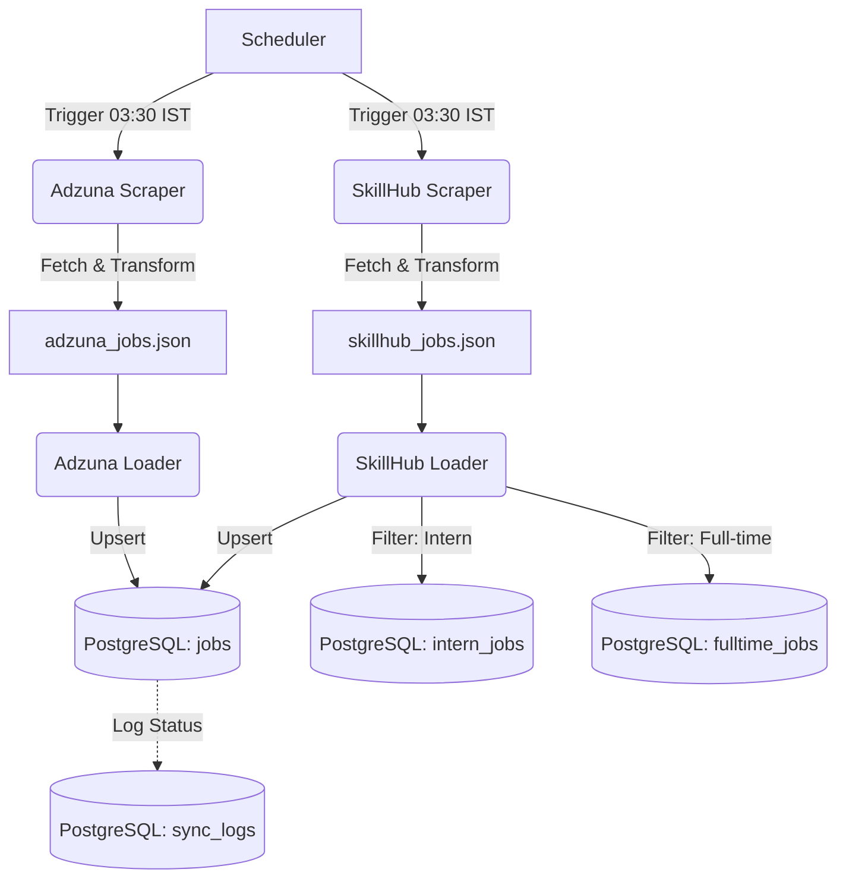

# Job Scraping Pipeline Implementation

This document details the technical implementation of the job scraping pipeline within the TrackHire ecosystem.

## 1. Pipeline Architecture

The pipeline follows a **Decoupled Extraction-Loading (EL)** pattern, where data is first extracted to a persistent buffer (JSON) before being ingested into the database.

### 1.1 Components
- **Scheduler (`scheduler.js`)**: Orchestrates the execution timing and manages pipeline state.
- **Scrapers (`scripts/[source]/[source]_scrapper.js`)**: Handle API communication and initial transformation.
- **Loaders (`scripts/[source]/[source]_load_to_db.js`)**: Handle database connectivity, schema mapping, and upsert logic.
- **Sync State (`scripts/utils/db_sync_state.js`)**: A metadata layer tracking success/failure of each run.

---

## 2. Low-Level Implementation Details

### 2.1 Extraction Phase (Example: SkillCareerHub)
The extraction logic focuses on fetching raw data and mapping it to a standard internal format.

```javascript
// skillcareerhub_scrapper_v0.js
function transformJob(job) {
    const newId = `${sanitize(job.company_name)}_${sanitize(job.title)}_${job.id}`;
    return {
        id: newId,
        company: job.company_name,
        title: job.title,
        location: job.location || job.company_location || null,
        employment_type: mapEmploymentType(job.type),
        description: buildDescription(job),
        posted_at: new Date(job.created_at).toISOString(),
        source: "SkillCareerHub"
    };
}
```

**Key Strategies:**
- **Deduplication Key**: A composite ID (`company_name + title + source_id`) is generated to prevent duplicate entries if the same job appears in multiple API calls or is updated.
- **Sanitization**: All input strings are normalized (lowercase, underscore replacement) for consistent ID generation.
- **Local Buffering**: Data is saved to `skillcareerhub_jobs.json`. This allows for re-running the loader without re-scraping the API, saving bandwidth and avoiding rate limits.

### 2.2 Loading Phase
The loader uses high-performance PostgreSQL upserts to maintain data freshness.

```sql
-- Conceptual Upsert Logic
INSERT INTO jobs 
(external_id, company, title, location, description, source, ...)
VALUES (...)
ON CONFLICT (external_id) DO UPDATE SET
    title = EXCLUDED.title,
    description = EXCLUDED.description,
    updated_at = CURRENT_TIMESTAMP
WHERE jobs.title IS DISTINCT FROM EXCLUDED.title;
```

**Implementation Features:**
- **Batch Processing**: Jobs are processed in batches (e.g., 500 rows) to optimize network round-trips to the database.
- **Schema Separation**: Jobs are intelligently routed to `intern_jobs` or `fulltime_jobs` tables based on title keywords, facilitating faster queries for specific user groups.
- **SSL Connectivity**: Configurable SSL support for secure communication with cloud databases (like Neon).

### 2.3 Orchestration & Monitoring
The `scheduler.js` manages the lifecycle of multiple pipelines.

```javascript
// scheduler.js
async function runSkillhubPipeline() {
    const syncId = await dbSync.startSync("skillcareerhub_v0");
    try {
        const scrapeStats = await skillhubScraper.run();
        const loadStats = await skillhubLoader.run(scrapeStats.filePath);
        await dbSync.completeSync(syncId, scrapeStats.count, loadStats.inserted);
    } catch (err) {
        await dbSync.failSync(syncId, err.message);
    }
}
```

**Monitoring Benefits:**
- **Last Cursor Tracking**: For paginated APIs (like Adzuna), the system stores the last fetched ID/Page, allowing the next run to resume from where it left off.
- **Failure Isolation**: If one source (e.g., SkillCareerHub) fails, the scheduler continues with others (e.g., Adzuna), ensuring partial data availability.

---

## 3. Data Flow Diagram



## 4. Current Deployment
- **Platform**: Railway (configured via `railway.toml`).
- **Database**: Neon Serverless Postgres.
- **Health Checks**: Pings Render services to ensure backend uptime during scraping windows.
